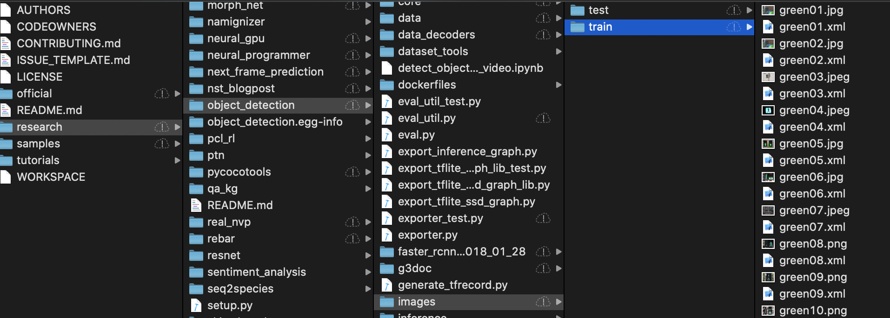
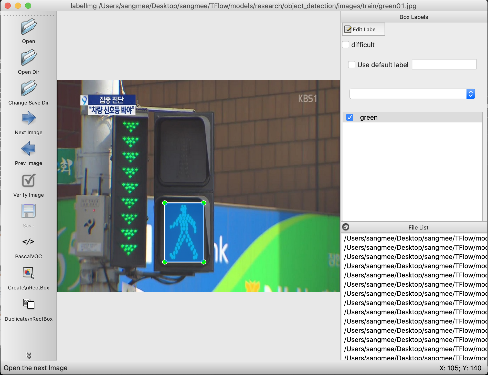
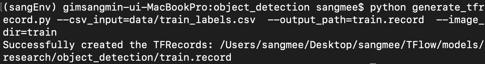

# Tensorflow Object-Detection API 사용하여 Custom model학습  & 안드로이드 스튜디오에 적용하기

##  환경설정    
  
### 1. python 3.6.5 버전으로 가상환경을 만들어준다.  

1. python 3.6.5 버전을 설치한다.
    - https://www.python.org/downloads/release/python-365/ 링크에서 macOS version을 install하고, 
    install과정에서 (Add Python 3.6 to PATH) 체크박스를 선택함으로써 Python 3.6.5버젼을 환경변수로 세팅한다. (전에 Python3를 install 했더라면, python3를 downgrade 시켜줘야 한다...)

1. virtualenv를 다운받는다.
    - $sudo pip install virtualenv   
        
1. 가상환경을 만들어 준다.    
    - $virtualenv --python==python3 (가상환경디렉토리 이름)
        
1. 가상환경으로 작업하려면 가상환경디렉토리가 있는 디렉토리에서 아래의 명령어 실행
    - $source (가상환경디렉토리 이름)/bin/actviate
  
  
  
### 2. 가상환경에 tensorflow object detection api를 사용하기위한 라이브러리들을 설치 한다.

    - $pip install tensorflow==1.8
    - $pip install Cython
    - $pip install contextlib2
    - $pip install pillow
    - $pip install lxml
    - $pip install jupyter
    - $pip install matplotlib

### 3. Clone this [Repository](https://github.com/tensorflow/models)
    - $git clone https://github.com/tensorflow/models

### 4. protobuf를 이용하여 research/object_detection/protos 디렉토리에 pb2.py 파일들 만들기
- 아래의 명령어로 protobuf 설치
- $brew install protobuf
- models/research 디렉토리로 이동
- $protoc object_detection/protos/*.proto --python_out=.
- 위 명령어 실행시 protos 디렉토리에 이름이 '_pb2.py'라고 끝나는 파일들이 많이 생성되 있을 것이다. 

### 5. 환경변수 등록
- $export PYTHONPATH=$PYTHONPATH:/PATH-TO/models/research:/PATH-TO/models/research/slim
- 위의 명령으로 임시로 환경변수를 등록할 수 있다. (/PATH-TO 대신 models를 저장한 디렉토리 경로를 작성해 주면 된다.)
- 위의 방법으로 하면 터미널을 끄고 킬 때마다 저 명령어를 실행 해줘야 한다. 
- 터미널을 껏다가 켜도 계속 환경변수가 유지 되게 하고 싶으면
$open ~/.bash_profile 명령어를 통해 .bash_profile 을 열어 맨 밑줄에 PYTHONPATH=$PYTHONPATH:/PATH-TO/models/research:/PATH-TO/models/research/slim 을 추가 해주면 된다.

### 6. 환경설정이 제대로 되었는지 확인하기
- models/research 디렉토리로 이동한 뒤, 밑에 명령어를 실행하자
- $python object_detection/builders/model_builder_test.py
- 잘 동작하면 제대로 환경설정이 된 것이고, 위의 라이브러리를 잘 설치 했는데 에러가 난다면, tensorflow 버젼(tensorflow 1.8 버젼 추천)이나 터미널을 껏다 켰는데 환경변수 등록하는 것을 잊은 건 아닌지 한번 확인해보자.

  
  ***

## 이미지 라벨링하기 

  
~~~    
이미지 라벨링 하기 전에 사전 작업은 자신이 학습 할 사진을 200장 정도 모아, models/research/object_detection/images
디렉토리에(images 디렉토리는 기존에 없을테니, 새로 만들면 된다.) train 과 test 폴더를 생성해 주고, train과 test 폴더에
사진을 각각 넣어준다.
~~~

1. [LabelImg Repository](https://github.com/tzutalin/labelImg) 클릭
2. $git clone https://github.com/tzutalin/labelImg  명령어로 repository 다운
3. $brew install qt
4. $brew install libxml2
5. 다운받은 repository의 LabelImg 디렉토리 안으로 들어가서
6. $python labelImg.py 명령어 실행
7. 위에 첨부한 이미지와 같은 labelimg 에디터가 나오면 이미지를 labeling 해준다. (단축키 w(라벨링), d(다음 사진), a(전 사진)) 
8. labelimg 에디터를 통해 얻은 .xml파일을 위에 이미지와 같이 같은 디렉토리안에 동일한 이름으로 저장한다.

 ***  
   
 ## .record 파일 만들기
 
~~~
TFRecord 파일 포맷이란
TFRecord 파일은 텐서플로우의 학습 데이타 등을 저장하기 위한 바이너리 데이타 포맷으로,
구글의 Protocol Buffer 포맷으로 데이타를 파일에 Serialize(직렬화) 하여 저장한다.

CSV 파일에서와 같이 숫자나 텍스트 데이타를 읽을때는 크게 지장이 없지만, 
이미지 데이타를 읽을 경우 이미지는 JPEG나 PNG 형태의 파일로 저장되어 있고,
이에 대한 메타 데이타와 라벨은 별도의 파일에 저장되어 있기 때문에, 
학습 데이타를 읽을때 메타데이타나 라벨용 파일 하나만 읽는 것이 아니라 이미지 파일도 별도로 읽어야 하기 때문에 코드가 복잡해진다.

또한 이미지를 JPG나 PNG 포맷으로 읽어서 매번 디코딩을 하게 되면, 그 성능이 저하되서 학습단계에서 데이타를 읽는 부분에서 많은 성능 저하가 발생한다.

이와 같이 성능과 개발의 편의성을 이유로 TFRecord 파일 포맷을 이용하는 것이 좋다.
~~~

- 위와 같은 이유로 TFRecord 파일로 변환하기 위해서 labelImg를 통해 생성한 xml 파일을 먼저 CSV 파일로 변환해야 한다.
1. https://github.com/datitran/raccoon_dataset 링크를 클릭하여 repository를 다운받자
2. xml_to_csv.py 파일과 generate_tfrecord.py 파일을 복사해 research/object_detection 폴더에 붙혀넣는다.
3. xml_to_csv.py 코드를 수정한다.
~~~
#from xml_to_csv.py

def main():
    image_path = os.path.join(os.getcwd(), 'annotations')
    xml_df = xml_to_csv(image_path)
    xml_df.to_csv('raccoon_labels.csv', index=None)
    print('Successfully converted xml to csv.')
~~~
~~~
#revised code

def main():
    for directory in ['train','test']:
        image_path = os.path.join(os.getcwd(), 'images/{}'.format(directory))
        xml_df = xml_to_csv(image_path)
        xml_df.to_csv('data/{}_labels.csv'.format(directory), index=None)
        print('Successfully converted xml to csv.')
~~~
4. object_detection 디렉토리에 data 디렉토리가 생성된 것을 볼 수 있고, data 디렉토리 안에는 두개의 .csv 파일이 생성된 것을 볼 수 있다.
5. generate_tfrecord.py 파일의 코드를 수정한다. 
    - labelimg에서 라벨링 한 이름을 row_label == '(여기)' 여기 안에 넣어주면 된다.
~~~
#from generate_tfrecord.py

def class_text_to_int(row_label):
    if row_label == 'raccoon':
        return 1
    else:
        None
~~~
~~~
#revised code

def class_text_to_int(row_label):
    if row_label == 'green':
        return 1
    elif row_label == 'red':
        return 2
    else:
        None
~~~

6. research/object_detection 디렉토리에서 아래의 명령어를 각각 실행시켜주면 된다.
~~~
# for test data
$python generate_tfrecord.py --csv_input=data/test_labels.csv  --output_path=test.record  --image_dir=images/test
~~~
~~~
# for train data
$python generate_tfrecord.py --csv_input=data/train_labels.csv  --output_path=train.record  --image_dir=images/train
~~~
7. 아래와 같이 나오면 research/object_detection 디렉토리에 train.record 파일과 test.record 파일이 생성 된다. 

